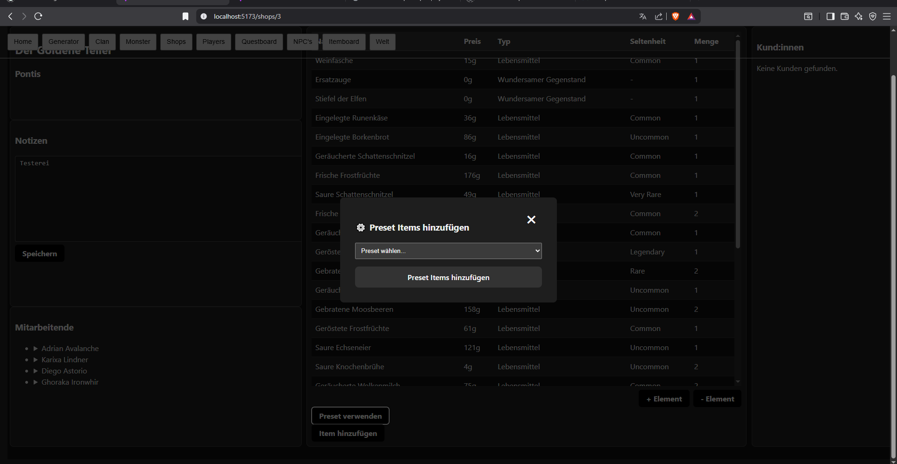

# Bedienungsanleitung

## Shops

Nachdem die Datei `run.bat` ausgeführt wurde, öffne einen Browser und besuche [http://localhost:5173](http://localhost:5173).

Du landest auf der **Main Page**. Über die **Navbar** kannst du zwischen den Seiten wechseln.

Wähle den Bereich **Shops**.

---

## Shop-Seite

Hier kannst du deine Shops verwalten und neue Geschäfte hinzufügen.

Mit einem Klick auf ein Geschäft werden die Shopnotizen geladen und angezeigt. Diese lassen sich direkt bearbeiten und über den Speichern-Button in der Datenbank speichern.

Wähle einen Shop und mache einen **Doppelklick** darauf, um die Shop-Detailseite zu öffnen.

---

## Shop-Detailseite

### Legende Übersicht:

1. Name und Ortschaft
2. Notizen zum Geschäft
3. Itemliste
4. Mitarbeiterliste
5. Kundenliste

---

### Item hinzufügen / bearbeiten

#### 1. Preset verwenden

- Klicke auf den Button **Preset verwenden**, um ein Preset auszuwählen.

    
    
  

Danach sieht die Seite so aus:  
Es werden automatisch verschiedene passende Items je nach Preset hinzugefügt.

  

---

#### 2. Item manuell hinzufügen

Um ein Item manuell hinzuzufügen, klicke auf **Item Hinzufügen**.

  

- Suche nach einem passenden Item und klicke darauf, um ggf. die Beschreibung zu lesen.

  

- Wähle Items über die Checkbox aus und trage die Menge rechts ein. Mehrere Items sind möglich.
- Klicke dann auf **Ausgewählte Items hinzufügen**.

  
  
  

Die hinzugefügten Items erscheinen nun auf der Seite. Um die Menge zu ändern, klicke auf das Item (Beschreibung wird angezeigt) und dann auf **+Element** oder **-Element**.

  
