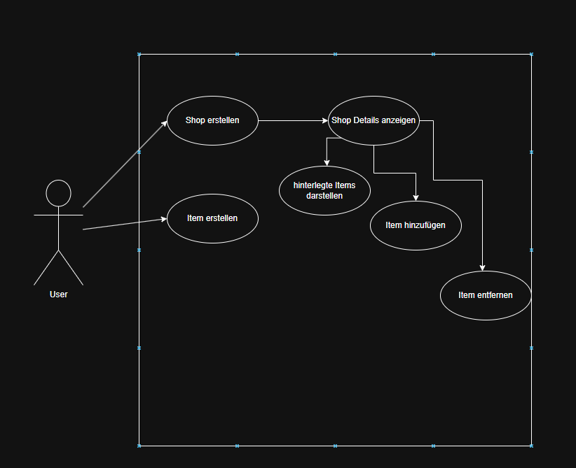

#  DnD Tool – Webbasiertes Spielleiter-Tool

Dies ist die frühe Ausarbeitung eines webbasierten Spielleiter-Tools zur Verwaltung und Erschaffung 
einer lebendigen DnD-Spielwelt.  
Der Prototyp dieses Werkes ward ursprünglich unter [DnD-WebUI](https://github.com/ElodinderBarde/DnD-WebUI) geboren und wird nun
als **eigenständige Spring Boot Applikation** weitergeführt, um sich von XAMPP zu lösen und 
ein modular aufgebautes Backend zu etablieren. Zudem soll diese im Späteren Verlauf eine 
Mulktiuserapplikation werden, mit eigenem Zugang und Db damit diese nicht mehr Lokal laufen muss.

---

##  Projektübersicht

Das Tool unterstützt die digitale Verwaltung einer lebendigen DnD-Spielwelt:  
Charaktere (NPCs/Spieler), Shops, Items, Clans, Quests, Rufsysteme u.v.m.  
Der Fokus liegt auf **Wartbarkeit**, **Modularität** und klar dokumentierten Schnittstellen.

---

## Im Rahmen des Moduls 295 wird die Seite Shops in den Fokus gelegt

### Anforderungsanalyse

Im rahmen dieser Anforderungsanalayse werden die Erwartungen an das DnD_Tool Backend erfasst. 
Die Anforderungen orientieren sich an den typischen Aufgaben Nutzer:innen in Form von User Stories, einem Use-case_Diagramm sowie konkreten funktionalen Anforderungen dokumentiert. 
Ziel ist es, die zentralen Interaktionen mit dem System nachvollziehbar und  technisch umsetzbar zu beschreiben


### User Stories

- **User Story 1**: [Shop erstellen ](https://github.com/ElodinderBarde/dnd_tool/issues/1)
- **User Story 2**: [Shop Item darstellen](https://github.com/ElodinderBarde/dnd_tool/issues/2)
- **User Story 3**: [Item hinzufügen oder löschen](https://github.com/ElodinderBarde/dnd_tool/issues/3)


### Use Case

Das UseCase Diagramm zeigt die Interaktion mit der Datenbank. Im ersten schritt sollten über 
die Itempage items ersteellt werden, die im anschluss einem erstellten Shop hinzugefügt werden. 
Hier soll ebenso dargestellt werden, dass dies unabhängig voneinander funktioniert. 





### Kernaufgaben
Die nachfolgende Liste dokumentiert die zentralen funktionalen Anforderungen der ShopSeite und ShopDetailSeite. Diese Anforderungen definieren, welche konkreten Fähigkeiten das System bieten muss, um die in den User Stories beschriebenen Anwendungsfälle abzudecken.

| ID | Funktionale Anforderungen                                                                     |
| :-: |:----------------------------------------------------------------------------------------------|
| F1 | Die Anwendung soll es ermöglichen,ein Geschäft zu erstellen und diesen an einen Ort zu binden |
| F2 | Die Anwendung soll alle gespeicherten Geschäfte darstellen können.                            |
| F3 | Die Anwendung soll es erlauben, Geschäfte nach ortschaftund Typ zu filtern                    |
| F4 | Die Anwendung soll einzelne Geschäfte anhand ihrer ID abrufen.                                |
| F5 | Die Anwendung soll es ermöglichen, ein bestehendes Geschäft zu bearbeiten.   (Notizen, Items) |
| F6 | Die Anwendung soll es ermöglichen, ein Item, welches an eine ID geknüpft wurde zu löschen.    |
| F7 | Die Anwendung soll anhand der Presets oder einzeln Items hinzufügen können.                   |
| F8 | Die REST-API soll im JSON-Format kommunizieren.                                               |


### Klassendiagramm

Aufgrund der Komplexität und Verwebung der Klassen in der Gesammten Anwendung, 
verwende ich hier nebst der Zugehörigen klassen ein vereinfachtes Relationsmodell der Klassen,
damit viele Redundanzen verhindert werden können. 


Im untenstehenden Klassendiagram, sind neun Gruppen dargelegt.

|    Klasse    | Kurzbeschrieb der Klasse in relastion zur DB Tabelle                                                                                                                                |
|:------------:|:------------------------------------------------------------------------------------------------------------------------------------------------------------------------------------|
|     City     | Alle hinterlegten Städte werden in dieser Tabellenklasse hinterlegt. diese werden in Zukunft auf der WorldPage beasrbeitbar sein                                                    |
|   Village    | Alle hinterlegten Dörfer werden in dieser Tabellenklasse hinterlegt. diese werden in Zukunft auf der WorldPage beasrbeitbar sein                                                    |
|   Location   | Diese Klasse ist eine Zwischentabelle, die die Location als LocationID aus CityId und VillageID zusammenfässt.                                                                      |
|   ShopType   | Eine Zwischentabelle die die Typen der Geschäfte zusammenfässt, diese soll erweiterbar sein, wurde jedoch noch nicht implementiert.                                                 |
|     Shop     | Diese Tabellenklasse ist der Mittelpunkt der Seite. auf dieser Tabelle werden die Namen, des Typs, der Ortschaft und die Notizen gespeichert                                        |
|   ShopItem   | Eine Zwischentabellenklasse, die die auf den Shop hinterlegte Items zusammenfässt. hier könnte auch ein Spezialpreeis hinterlegt werden, wurde jedoch noch nicht implementiert.     |
|     Item     | Eine Tabellenklasse die der Mittelpunkt der ItemPage ist. auf dieser Liste werden alle Items hinterlegt, sowie preise, seltenheiten ressource und weitere Informationen hinterlegt. | 
| ShopRelation | Eine Zwisachentabellenklasse die die Relation von NPC zu Geschäften speichert.                                                                                                      |
| ShopEmployee | Eine Tabellenklasse, die verschiedene Anstellungspositionen sammelt.                                                                                                                |
| ShopCustomer | Eine Tabellenklasse, die verschiedene Kundenpositionen sammelt.                                                                                                                     |


Zur besseren Lesbarkeit wurden alle Abhängigkeiten als «uses»-Beziehungen gekennzeichnet. 
Die Pfeile geben jeweils an, welche Klasse eine andere verwendet.
Das Diagramm bietet damit eine übersichtliche Darstellung der Klassenstruktur und erleichtert 
das Verständnis für den Aufbau und die Verantwortlichkeiten innerhalb der Anwendung.


## REST-Schnittstellen
Die entwickelte Applikation stellt eine REST-API zur Verfügung,
über die alle relevanten Operationen durchgeführt werden können.
Diese Schnittstellen bilden die zentrale Interaktionsebene für das Frontend sowie potenzielle
Drittanwendungen.
Darunter fallen `ShopController`, `ItemController`, `ShopItemController`, `ShopTypeController`, `ShopEmployeeController`
`ShopRelationsController`, `LocationController`, `CityController`, `VillageController` und `ShopCustomerController`

Der Übersicht und Erweitbarkeitswegen wurden diese auf diese Aufgeteilt. Um Redundanzen zu vermeiden lege ich hier den Fokus auf
`ShopController`, `ShopItemController` und `ItemController`

### Unterstützte Endpunkte
|     Controller      | Methode  | Pfad                  | Beschreibung                                                       |
|:-------------------:|:--------:|:----------------------|:-------------------------------------------------------------------|
|   ShopController    |  `GET`   | "/api/shops"          | Gibt alle verfügbaren Shops zurück                                 |
|   ShopController    |  `GET`   |"/{id}| Gibt den verfügbaren Shop mit der angegeben ID zurück              |
|   ShopController    |  `PUT`   | "/{id}"               | Aktualisiert die Shopnotizen                                       | 
|   ShopController    |  `POST`  |                       | Erlaubt es über den DTO und Serviceklasse Shops zu erstellen       |
|   ShopController    | `Delete` | "/{id}"               | Ermöglicht das Löschen eines Geschäfts                             |
|   ShopController    |  `GET`   | "/{shopId}/employees" | Gibt alle an ShopId gebundenen Mitarbeiter zurück                  |
|   ShopController    |  `GET`   | "/{shopId}/customers" | Gibt alle an ShopId gebundenen Kunden zurück                       |
| ShopItemController  |  `GET`   | "/api/shopItems | Gibt alle Items zurück, die an ein geschäft verbunden sind         |
| ShopItemController  | `GET`|"/shop/{ShopId}| gibt alle Items zurück die an den Shop gebunden sind               |
| ShopItemController  | `POST`|"/addItems" | erlaubt es ein Item an einen Shop hinzuzufügen                     |
| ShopItemCOnttroller |`PUT`|"/{shopItemId}/quantity| erlaubt es die hinterlegte Itemmenge anzupassen                    |
|   ItemController    |`GET`| "/api/items"| Gibt alle hitnerlegten Items zurück                                |
|   ItemController    | `GET`| "/resources" | GIbt alle hinterlegten Ressourcen zurück                           |
|   ItemController    | `POST`|| Erlaubt es über den DTO un der Serviceklasse ein Item zu erstellen |


- **CORS-Konfiguration**: Um Cross-Origin-Anfragen vom Frontend (z. B. `http://localhost:5173`) 
- zu ermöglichen, wurde die API gezielt für bestimmte Ursprünge freigegeben. Dies geschieht in der 
- `WebConfig`-Klasse, welche `WebMvcConfigurer` implementiert und die Methode `addCorsMappings()` 
- überschreibt, um gezielt Pfade freizuschalten.


## Beispiel für eine Anfrage
>**POST**: `/addItems`

Erstellt eine neue verbindung zwischen einem Item und einem Geschäft basierend auf den übergebenen Daten.

Die Anfrage erwartet ein JSON-Objekt basierend auf dem `ShopItemDTO`.

**Request-Body (JSON)**:
```json
{
  "ShopItemID": 55,
  "shopId": 25,
  "ItemID": 5,
  "quantity": 5,
  "Item":   {
    "id": 5,
    "name": "Weinfasche",
    "price": 15,
    "typ": "Lebensmittel",
    "seltenheit": "Common",
    "buch": "Eigene",
    "seite1": null,
    "seite2": null,
    "seite3": null,
    "einstimmung": "N",
    "beschreibung": null
  }
}
```

##  Features (Geplant / In Umsetzung)

- **NPC-Verwaltung**: Erstellen, Generieren, Bearbeiten, Notizen speichern
- **Shops**: Verwaltung von Händlern & Sortiment
- **Items**: Erstellen und Ressourcen zuweisen
- **Ortschaften**: Anlegen und verwalten
- **Monster**: Bestien erzeugen und verwalten
- **Clans**: Soziale Strukturen mit Rufsystem
- **Spieler**: Erfassen & verwalten
- **Quests**: Anlegen, Zuordnen und Verfolgen
- **Rufsystem**: Beziehungen zwischen Spielern, Clans und NPCs

---

##  Tech Stack

| Ebene      | Technologie                  |
|------------|------------------------------|
| **Backend** | Java 21, Spring Boot 3.x, Maven |
| **Datenbank** | MySQL (via JDBC, später evtl. JPA) |
| **Frontend** | React, Vite, Tailwind CSS (optional) |
| **API**     | RESTful, JSON |

---

## Projektstruktur

```plaintext
dnd_tool/
├── backend/       # Spring Boot REST-API
  └── database      # SqlDatei für Grund-Datenbank
  └── src
    └── main
      └── java
        └── ch.Elodin.DnD_Tool
          ├── config
          ├── controller
          ├── dto
          ├── mapper
          ├── model
          ├── repository
          ├── service
        └──DnDToolApplication.java   #MainDatei
          
├── frontend/      # Vite + React Benutzeroberfläche
  ├──src
    ├── assets
    ├── components          #komponenten
      ├── components_css
      ├── createNpc
      ├── items
      ├── npc-detail-page
      ├── npcBoard
      ├── questboard
      ├── shop-details
      ├── shops
    └── navbar.jsx          # Navbarkomponente 

  ├── pages
  ├── service

└── install.bat
└── README.md
└── run.bat

```

## Lokale Einrichtung (Entwicklung)
Voraussetzungen
Java 21 (Temurin empfohlen)

Node.js (v18+)

MySQL-Datenbank

Maven


## Installation
```
Prüfen ob Java 21 Installiert ist
Prüfen ob Node.js Installiert ist
Prüfen ob Maven installiert ist
Prüfen ob MySql Server installiert ist und aktiv ist


install.bat ausführen

root Benutzername eintragen
root Passwort eintragen //Achtung, Passwort wird im klartext dargestellt!

nun wird die benötigte db erstellt und User angelegt

bei erfolgreichem Import wird run.bat ausgeführt

Wenn Spring Boot Server erfolgreich gestartet wurde:
öffne einen beliebigen Browser und besuche die Adresse : localhost:5173


```


Backend starten

run.bat ausführen oder 


```bash

cd backend
./mvnw spring-boot:run
# Läuft auf: http://localhost:8081

```


Frontend starten

```bash
cd frontend
npm install
npm run dev
# Läuft auf: http://localhost:5173
``` 


API Proxy (in vite.config.js)

```js
server: {
  proxy: {
    '/api': {
      target: 'http://localhost:8081',
      changeOrigin: true,
      rewrite: path => path.replace(/^\/api/, '')
    }
  }
}
```


🚧 Entwicklungsstand
⚠️ Dieses Projekt befindet sich in einem frühen Stadium.
Die Architektur wird fortlaufend modularisiert, das Datenmodell verfeinert und eine vollständige API aufgebaut.

👤 Autor
Elodin, Webzauberer & Spielleiter aus der Schweiz
GitHub: ElodinderBarde

🧾 Lizenz
Lizenzierung folgt im weiteren Verlauf der Entwicklung.
Aktuell private Nutzung. Kein öffentlicher Rollout vorgesehen.


## 📚 Rechtlicher Hinweis

Dieses Tool verwendet Teile der **Dungeons & Dragons 5e System Reference Document (SRD 5.1)**, veröffentlicht von **Wizards of the Coast** unter der **Creative Commons Attribution 4.0 International License (CC-BY-4.0)**.

[Link zur SRD 5.1](https://dnd.wizards.com/resources/systems-reference-document)

Alle Rechte an Dungeons & Dragons, den zugehörigen Namen, Marken, Welten und Charakteren verbleiben bei Wizards of the Coast.  
Dieses Projekt ist ein **inoffizielles Fanprojekt** und steht in **keiner offiziellen Verbindung** zu Wizards of the Coast.


🌱 Zukunftsideen (Vision)
Nutzerverwaltung & Sessions

Export/Import von Welten & NPCs

Admin-Dashboard für Live-Spielleitung

Mobile-optimierte Companion-Ansicht für Spieler

